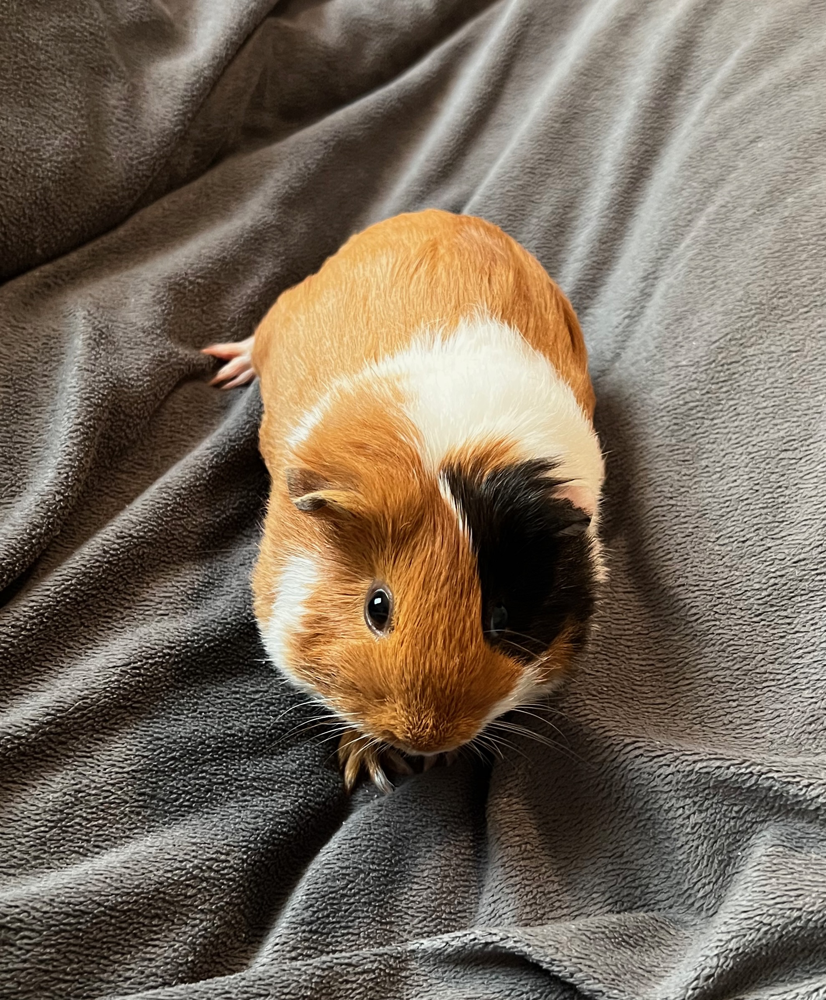
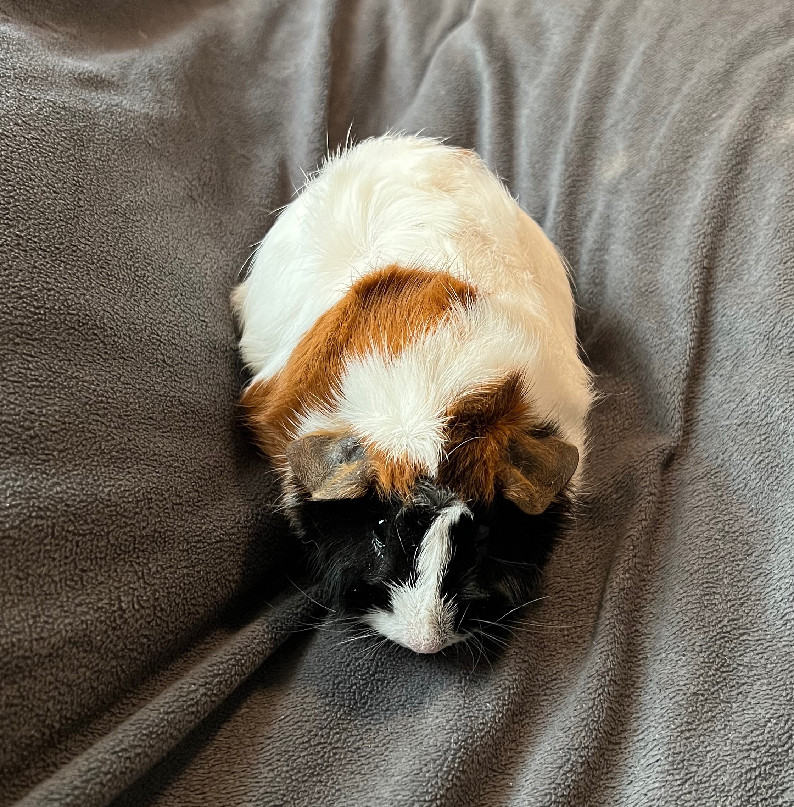

# OOP Pet Growth Tracker

## Purpose
This is a project to help me practice programming concepts as I learn them with real-world data. It is a place for me to experiment with design concepts and implementations to help me develop my programming ability.  

I may expand it to be its own standalone app eventually, but for now it is just another place for me to store some data on my pets and add new refinements as I learn them. 

And of course, here are Reese and Puff:

